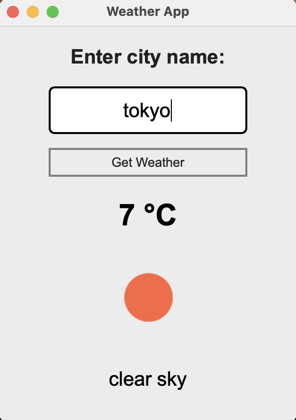

# 🐍 BroCode Python Full Course

This repository contains my completed practice files from the [Bro Code Python Full Course (12 Hours)](https://youtu.be/ix9cRaBkVe0?si=o-7TRskfac0EaVx-).


Each numbered Python file corresponds to a lesson from the course, covering:

- Python fundamentals  
- Control flow  
- Functions  
- Object-Oriented Programming  
- Small exercises and mini projects  

The main highlight of this repository is the final project:

---

# 🌦 Weather App (PyQt5)

A desktop weather application built using **Python and PyQt5**, powered by the [OpenWeather API](https://openweathermap.org)

<p align="center">
  
</p>

---

## 🔎 Features

- Accepts a city name as user input  
- Sends a real-time API request to OpenWeather 
- Parses JSON weather data
- Displays:
  - 🌡 Temperature (converted from Kelvin to Celsius)
  - 🌤 Weather description (got from OpenWeather website)
  - 🖼 Dynamic weather icon
- Handles invalid API responses gracefully  
- Stores API key securely using `.env`  

---

## 🛠 Tech Stack

- Python  
- PyQt5 (GUI framework)  
- Requests (HTTP client)  
- python-dotenv (environment variables)  
- OpenWeather API  

---

## How to Run

### 1. Install dependencies

```bash
pip install PyQt5 requests python-dotenv
```

### 2. Create a `.env` file in the project root

```
API_KEY=your_openweather_api_key
```

> ⚠️ Do not commit your API key to GitHub.

### 3. Run the application

```bash
python "77-weather app.py"
```

---

## 💡 What This Project Demonstrates

- GUI layout design with Qt  
- API integration  
- JSON parsing  
- Environment variable handling  
- Error handling  
- Basic UI styling with Qt stylesheets  

---

This repository marks my completion of the Bro Code Python course and serves as a foundation for building more advanced Python projects.